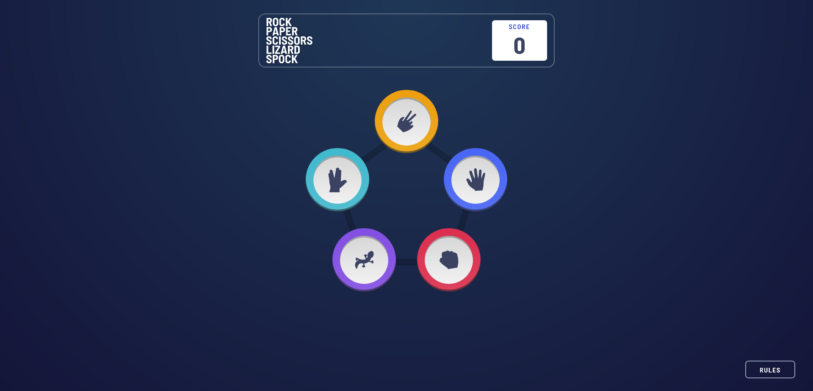
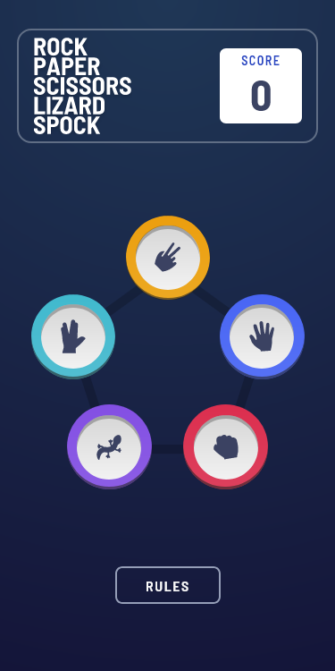

# Frontend Mentor - Rock, Paper, Scissors solution

This is a solution to the [Rock, Paper, Scissors challenge on Frontend Mentor](https://www.frontendmentor.io/challenges/rock-paper-scissors-game-pTgwgvgH). Frontend Mentor challenges help you improve your coding skills by building realistic projects. 

## Table of contents

- [Frontend Mentor - Rock, Paper, Scissors solution](#frontend-mentor---rock-paper-scissors-solution)
  - [Table of contents](#table-of-contents)
  - [Overview](#overview)
    - [The challenge](#the-challenge)
    - [Screenshot](#screenshot)
    - [Links](#links)
  - [My process](#my-process)
    - [Built with](#built-with)
    - [What I learned](#what-i-learned)
    - [Continued development](#continued-development)
  - [Author](#author)

## Overview

### The challenge

Users should be able to:

- ✔ View the optimal layout for the game depending on their device's screen size
- ✔ Play Rock, Paper, Scissors against the computer
- ✔ Maintain the state of the score after refreshing the browser _(optional)_
- ✔ **Bonus**: Play Rock, Paper, Scissors, Lizard, Spock against the computer _(optional)_

### Screenshot





### Links

- Solution URL: [Github](https://github.com/Clonephaze/rock-paper-scissors-master)
- Live Site URL: [Github Pages](https://clonephaze.github.io/rock-paper-scissors-master/)

## My process

### Built with

- Semantic HTML5 markup
- CSS custom properties
- Flexbox
- Vanilla JavaScript/HTML/CSS
- [Animista CSS library](https://animista.net/) for CSS animations


### What I learned

I learned a lot about Javscript on this one! Which is good, cause that was my entire goal for this project. I watched some videos and looked at some other projects on codepen to see other peoples approach, then smashed things together until it worked right! I think I did a pretty good job actually, like this javascript section:

```js
switch (userChoice + computerChoice) {
        case "scissorspaper":
        case "paperrock":
        case "rocklizard":
        case "lizardspock":
        case "spockscissors":
        case "scissorslizard":
        case "paperspock":
        case "rockscissors":
        case "lizardpaper":
        case "spockrock": {
            console.log(`You chose ${userChoice} and the computer chose ${computerChoice}`);
            choiceMade("win", computerChoice);
        }
        break;
        case "scissorsscissors":
        case "paperpaper":
        case "rockrock":
        case "lizardlizard":
        case "spockspock": {
            console.log(`You and the computer both chose ${userChoice}`);
            choiceMade("tie", computerChoice);
        }
        break;
        default: {
            console.log(`You chose ${userChoice} and the computer chose ${computerChoice}`);
            choiceMade("lose", computerChoice);
        }

    }
```
I personally think that looks great for being basically the entire game logic lol. 

### Continued development

Definitely wanna work on some more games to sharpen my javascript skills some more.

## Author

- Website - [Clonephaze](https://www.github.com/Clonephaze)
- Frontend Mentor - [@Clonephaze](https://www.frontendmentor.io/profile/Clonephaze)
